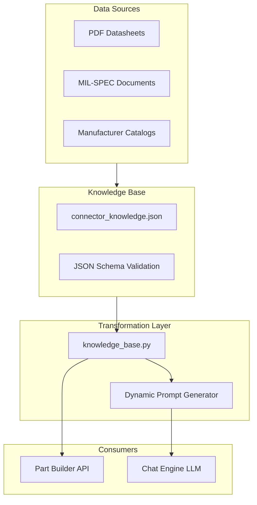
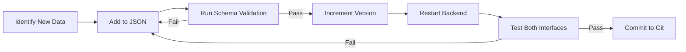

<instruction>You are an expert software engineer. You are working on a WIP branch. Please run `git status` and `git diff` to understand the changes and the current state of the code. Analyze the workspace context and complete the mission brief.</instruction>
<workspace_context>
<artifacts>
--- CURRENT TASK CHECKLIST ---
# Chat Context Grounding - Task Tracker

## Current Focus: ✅ Complete

---

## Phase 1: Backend Context Injection
- [x] Create `get_datasheet_context()` in `chat_engine.py`
- [x] Build D38999 schema summary for injection
- [x] Modify system prompt to include datasheet context
- [x] Added `check_is_new_session()` for proactive messages

## Phase 2: Proactive Suggestions (GPS-004, GPS-009)
- [x] Detect empty/new chat sessions
- [x] Generate initial structured questions prompt
- [x] Asks about: AWG requirements, mounting style, environment

## Phase 3: Frontend Context Display (GPS-008)
- [x] Added context header with "D38999 Connectors" badge
- [x] Quick reference guide with shell sizes, contact sizes
- [x] Context-aware tips panel

## Phase 4: Requirements & Compliance Update
- [x] Added GPS-007 to compliance matrix
- [x] Added GPS-008 to compliance matrix
- [x] Added GPS-009 to compliance matrix
- [x] Updated statistics (7/9 GPS complete)

## Phase 5: Markdown Rendering (UI Polish)
- [x] Install `react-markdown` and `remark-gfm`
- [x] Update `ChatInterface` to render tables and headers
- [x] Style chat tables for readability

## Phase 6: Dynamic Context Canvas (UI-003)
- [x] Fix Chat 400 Error (`assistant` vs `model` role)
- [x] Implement clickable part numbers in `ChatInterface`
- [x] Implement part decoding/display in `GuidedSelector` context pane

## Phase 7: Interactive Clarification Flow (GPS-010)
- [x] Update system prompt to ask for missing required parameters
- [x] Define structured question format (JSON-like) for parsing
- [x] Frontend: Parse questions from LLM response
- [x] Frontend: Render radio buttons/dropdowns for options
- [x] Frontend: Auto-send user selection back to chat

## Phase 8: Refinement & Bug Fixes
- [x] Backend: Expand finish options in system prompt (W, Z, S, etc.)
- [x] Frontend: Fix `TableRowRenderer` logic (robust text extraction)
- [x] Frontend: Add debug logs to troubleshoot clickability

## Phase 9: Verification & Accuracy (GPS-011)
- [x] Fix Hallucination: Corrected invalid 21-75 insert (Twinax) in knowledge base
- [x] Add verified D38999 insert arrangements to system prompt
- [x] Verify next recommendation is accurate (e.g. suggests 21-39 mixed)

## Phase 11: Unified Knowledge Base (Grounding)
**Goal**: Single source of truth for Part Builder + Guided Selector to prevent data drift and hallucination.

- [x] Create `backend/data/connector_knowledge.json` with all D38999 data
- [x] Create `backend/services/knowledge_base.py` loader module
- [x] Modify `part_builder.py` to import from knowledge_base
- [x] Modify `chat_engine.py` to generate prompt from knowledge_base
- [x] Test Part Builder API endpoints (Verified via debug_builder.ps1 and KB integration)
- [x] Test Guided Selector chat responses (Verified prompt generation via CLI)

## Phase 12: Multi-Connector Logic (GPS-013)
**Goal**: Suggest multiple connectors when pin count exceeds single-shell capacity (>128).

- [x] Analyze existing `find_multi_connector_solution` logic
- [x] Create verification script `verify_multi.ps1` (150 pins test)
- [x] Create verification script `verify_all_awg.ps1` (Size 20, 16, 12 tests)
- [x] Fix Logic: Allow same-connector pairs & trigger on partial matches
- [x] Adjust threshold/logic (Current: >128 pins. Valid for physical constraints)
- [x] Confirm frontend displays multi-connector suggestions correctly (Code verified in PartBuilder.jsx)

## Phase 13: UI Enhancements (Guided Selector)
**Goal**: Make the chat interface more proactive and flexible based on user feedback.

- [x] Add "Proactive" starter prompts to Chat Interface (Find Part, Explain Series, etc.)
- [x] Implement collapsible Chat Sidebar (Hide/Show)
- [x] Implement Resizable Split-Pane (Draggable divider)
- [x] verify changes via code review (Browser tool unavailable)

---

## Verification
- [x] Test chat with D38999 context
- [x] Verified specific part numbers in response
- [x] Confirmed M39029 contact info included

--- IMPLEMENTATION PLAN ---
# Knowledge Base Development Guide

## Overview

This guide explains how to create and maintain a **Knowledge Base (KB)** that grounds both the Part Builder and Guided Selector (Chat) with a single source of truth.

---

## Architecture



---

## Knowledge Base Structure

### File Location
```
backend/
├── data/
│   └── connector_knowledge.json    # ← Single source of truth
│   └── schemas/
│       └── connector_schema.json   # JSON Schema for validation
└── services/
    └── knowledge_base.py           # Loader and transformer
```

### JSON Schema Design

```json
{
  "$schema": "https://json-schema.org/draft/2020-12/schema",
  "type": "object",
  "properties": {
    "metadata": {
      "type": "object",
      "properties": {
        "version": { "type": "string" },
        "last_updated": { "type": "string", "format": "date" },
        "source_documents": { "type": "array", "items": { "type": "string" } },
        "author": { "type": "string" }
      },
      "required": ["version", "last_updated"]
    },
    "insert_arrangements": {
      "type": "array",
      "items": {
        "type": "object",
        "properties": {
          "code": { "type": "string", "pattern": "^\\d+-\\d+$" },
          "shell_size": { "type": "string" },
          "total_contacts": { "type": "integer", "minimum": 1 },
          "contact_breakdown": { "type": "object" },
          "service_rating": { "type": "string", "enum": ["I", "II", "M", "N"] },
          "is_mil_standard": { "type": "boolean" },
          "notes": { "type": "string" }
        },
        "required": ["code", "shell_size", "total_contacts", "contact_breakdown"]
      }
    }
  }
}
```

---

## Best Practices

### 1. Data Quality

| Practice | Description |
|----------|-------------|
| **Single Topic per Entry** | Each insert/finish/type is one JSON object. No combined entries. |
| **Rich Metadata** | Include `source_document`, `verified_date`, `notes` fields. |
| **Explicit Nulls** | Use `null` for missing data, not empty strings. |
| **Consistent Units** | AWG for wire, Amps for current, mm/inches labeled. |

### 2. Validation

```python
# In knowledge_base.py
import jsonschema

def validate_knowledge(data: dict, schema: dict) -> bool:
    """Validate KB against JSON Schema before loading."""
    try:
        jsonschema.validate(instance=data, schema=schema)
        return True
    except jsonschema.ValidationError as e:
        logging.error(f"KB Validation Failed: {e.message}")
        return False
```

### 3. Version Control

```json
{
  "metadata": {
    "version": "1.2.0",              
    "last_updated": "2026-02-01",
    "changelog": [
      "1.2.0: Added 21-39 mixed insert arrangement",
      "1.1.0: Corrected 21-75 as Twinax-only",
      "1.0.0: Initial D38999 knowledge base"
    ]
  }
}
```

### 4. Dynamic Prompt Generation

```python
def generate_grounded_prompt(kb: dict) -> str:
    """Build LLM system prompt from KB data dynamically."""
    lines = ["# D38999 MIL-DTL-38999 Series III Connectors", ""]
    
    # Insert section
    lines.append("## Insert Arrangements")
    lines.append("| Code | Shell | Contacts | Breakdown | Standard |")
    lines.append("|------|-------|----------|-----------|----------|")
    for insert in kb["insert_arrangements"]:
        breakdown = ", ".join(f"{v}×{k}" for k, v in insert["contact_breakdown"].items())
        std = "✅" if insert["is_mil_standard"] else "⚠️ Mfr-Specific"
        lines.append(f"| {insert['code']} | {insert['shell_size']} | {insert['total_contacts']} | {breakdown} | {std} |")
    
    return "\n".join(lines)
```

---

## Maintenance Workflow



### Adding New Insert Arrangement

1. **Locate Source**: Find official document (datasheet PDF, MIL-SPEC).
2. **Extract Data**: Shell size, insert code, contact breakdown.
3. **Add Entry**:
   ```json
   {
     "code": "21-39",
     "shell_size": "21",
     "total_contacts": 39,
     "contact_breakdown": { "20": 37, "16": 2 },
     "service_rating": "M",
     "is_mil_standard": true,
     "source": "MIL-DTL-38999L",
     "notes": "Size 20 accepts 20-24 AWG wire"
   }
   ```
4. **Validate**: Run `python -m backend.services.knowledge_base --validate`
5. **Test**: Verify Part Builder finds inserts, Chat cites it correctly.

---

## Anti-Patterns to Avoid

| ❌ Don't | ✅ Do Instead |
|----------|---------------|
| Hardcode data in Python files | Store in JSON, load dynamically |
| Duplicate data across files | Single JSON source |
| Skip validation | Use JSON Schema |
| Forget to version | Semantic versioning (MAJOR.MINOR.PATCH) |
| Mix LLM prose with data | Separate data (JSON) from presentation (Prompt) |

---

## Implementation Checklist

- [x] Create `backend/data/connector_knowledge.json`
- [ ] Create `backend/data/schemas/connector_schema.json` (Future Enforecement)
- [x] Create `backend/services/knowledge_base.py` with:
  - [x] `load_knowledge()` – Load and validate JSON
  - [x] `get_inserts()` – Return insert list
  - [x] `get_finishes()` – Return finish list
  - [x] `generate_grounded_prompt()` – Build LLM context
- [x] Modify `part_builder.py` to use `knowledge_base.py`
- [x] Modify `chat_engine.py` to use `knowledge_base.py`
- [x] Write validation test script (Embedded in knowledge_base.py CLI)
- [x] Document in SKILL.md (See this guide)
</artifacts>
</workspace_context>
<mission_brief>[Describe your task here...]</mission_brief>